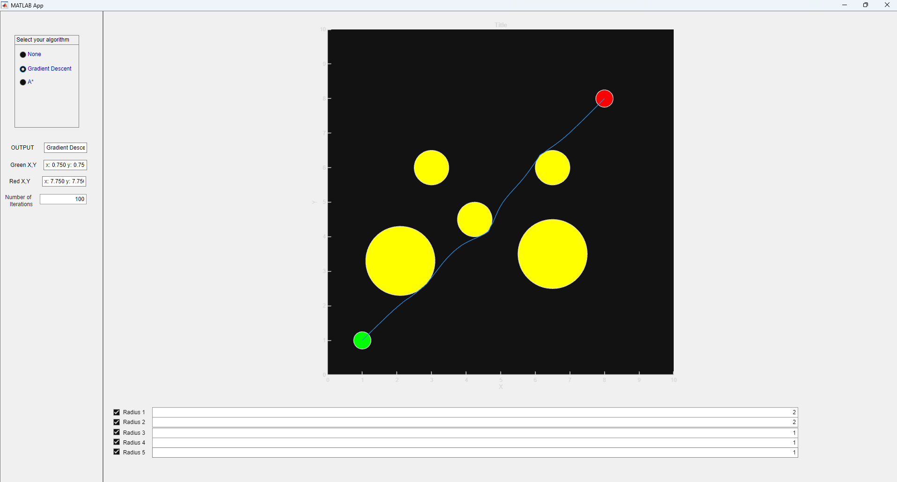

# path-planning-ostacles
QEA2 final project which is creating a path planning algorithm with obstacle avoidance using a gradient descent algorithm and A*

Gradient Descent demo

A Star demo

To run our code simply download Path Planning with obstacle avoidance.mlappinstall, but the supporting code can be found in this repo too
Our final report can be found here: https://docs.google.com/document/d/15HrCOirV7N5bWt0yaJgDRiQNYiOsWJlDTVD2pA_Qi2c/edit?usp=sharing

Learning goal: 
At the end of this project, we will be able to effectively explain to another Oliner how gradient descent is applied in path generation by developing a model that generates a path using these concepts.

Overview of Project and Approach
We wanted to be able to create a path for a robot to follow from point A (green) to point B (red) with obstacles in the way (yellow circles). 
We chose to approach this by using gradient descent optimization, which allowed us to deepen our understanding of this concept through practical application.	